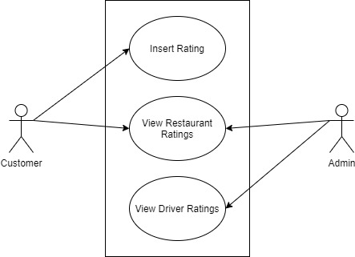

# ITCS-3160
### Author
Joseph Gaynier
### Description
ITCS-3160 project with frontend, backend, and database 
### Introduction (Team, Project Description)
### Use Case for Rating System

### Business Rules
### EERD (full database)

### MySQL Queries
### Stored Procedure
### Web/App Implementation (Optional) or Description of Future Work
### MySQL dump
### PPT Video (link)
